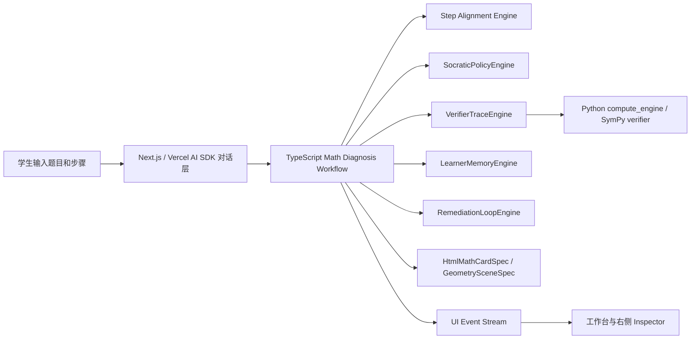

# DeepSeek GUI 参考与高中数学私教工作台设计

## 来源审计

本轮已从 GitHub 下载 `XingYu-Zhong/DeepSeek-GUI` 到：

```text
opensource-bases/deepseek-gui
```

选择它作为参考的原因：

- 它不是普通聊天界面，而是面向 agent 的本地工作台。
- 前端使用 React、Tailwind、Zustand，适合参考状态管理和工作台布局。
- 架构把前端 UI 和 agent runtime 分离，renderer 只消费 HTTP/SSE 事件。
- 工具调用、文件变更、推理步骤、审批状态都可观察，适合迁移为数学诊断的 VerifierTrace 和 Tool Event。

需要注意：DeepSeek GUI 是 Electron 桌面应用，本项目主体是 Next.js Web App，因此只参考界面结构、运行时边界和事件可观察性，不直接复制 Electron/Kun runtime。

## 对本项目的核心启发

高中数学私教页面不应是单一聊天框，而应是“数学学习工作台”：

```text
左侧：学生、题型、历史诊断、错因画像
中间：题目、学生步骤、苏格拉底对话、订正卡
右侧：首错定位、错因原子、严格门禁、验证链、变式训练、几何实验
```

页面的第一屏就是可用产品，而不是营销 landing page。学生进入后应该马上能输入题目和步骤，看到 agent 如何定位第一错步，并继续被追问、订正、训练迁移。

## 页面设计

### 顶部状态栏

- 当前模型：默认 `deepseek/deepseek-v4-flash`，高风险复核 `deepseek/deepseek-v4-pro`。
- 当前模式：诊断、订正、变式训练、几何实验、错因画像。
- 后端状态：TypeScript workflow、Python verifier、Geometry validator 是否可用。
- 风险状态：低置信、需要人工复核、验证未完成。

### 左侧学习导航

- 学生当前学习画像。
- 最近诊断记录。
- 错因原子高频榜，例如 A07 定义域意识、A11 跳步结论、A18 参数分类、A34 立体几何转换。
- 题型入口：导数、函数、二次函数、不等式、立体几何、解析几何。
- 本周训练计划和待完成变式。

### 中央诊断画布

- 题目输入区：文字、公式、后续可扩展图片 OCR。
- 学生步骤输入区：要求学生写出自己的每一步，不鼓励只问答案。
- 对话区：苏格拉底追问优先，不先给完整答案。
- 订正卡：只渲染白名单 `HtmlMathCardSpec` block，不允许模型输出任意 JS。
- 同因变式：按表层变式、结构变式、迁移变式、Boss 综合题递进。

### 右侧 Agent Inspector

右侧是本项目区别于普通搜题软件的关键区域：

- 第一错步：精确到学生哪一句、哪一步、哪一个表达式先错。
- 错因原子：显示 atom id、标签、层级、解释和置信度。
- 严格门禁：显示每个 deterministic gate 的 pass/fail/warn。
- VerifierTrace：显示 claim、verifier、status、failureReason、evidenceIds。
- LearnerMemoryDelta：显示本次会如何更新学生画像和 mastery。
- RemediationPlan：显示下一步训练计划。
- Geometry Lab：立体几何题进入 3D/HTML 图上讲解。

## Agent 架构设计

DeepSeek GUI 的关键思想是“UI 不承载 agent 逻辑，只展示 runtime 事件”。本项目应采用同样原则：



### TypeScript 主控

后续迁移方向保持不变：

- TypeScript 负责 agent、tool calling、工作流、错因原子、严格门禁、图谱协议和 UI。
- Python 只保留 TS 不擅长的部分：SymPy、OCR、几何计算、复杂代数验证。
- Qwen-Agent 作为后端 tool/agent 基座保留，但 Web 产品主流程由 Vercel AI SDK 和 TypeScript workflow 管理。

### 事件协议

参考 DeepSeek GUI 的可观察 runtime，诊断过程应逐步输出事件：

```text
diagnosis_started
student_steps_aligned
strict_gate_checked
verifier_trace_added
policy_decided
correction_card_ready
learner_memory_delta_ready
remediation_plan_ready
geometry_lab_recommended
diagnosis_completed
```

UI 只展示这些结构化事件，不根据大模型自然语言猜测诊断状态。

## 视觉风格

- 风格：安静、理性、面向高强度学习的工作台。
- 色彩：浅色/深色都可，但避免大面积紫色 AI 渐变。
- 重点色：蓝色表示系统动作，琥珀表示待确认，红色表示首错或 fail gate，绿色表示验证通过。
- 卡片只用于诊断结果、工具事件、变式题等明确对象，不把整个页面堆成卡片。
- 公式必须可读，移动端不能溢出；长公式优先横向滚动或换行。

## 落地顺序

1. 保留当前 Next.js/Vercel AI Chatbot 主体。
2. 将聊天页改造成三栏学习工作台：左侧学习导航，中间诊断画布，右侧 Agent Inspector。
3. 把现有 `MathDiagnosisCard` 拆成首错、错因、验证链、画像、训练计划几个可复用面板。
4. 增加工具事件时间线，让学生看见 agent 是如何判断的。
5. 将 Geometry Lab 与诊断结果打通，几何题从错因原子直接跳转到对应关卡或图上讲解。
6. 后续再加入 DeepSeek/Qwen 多模型复核、OCR、3D 几何和可保存学习报告。

