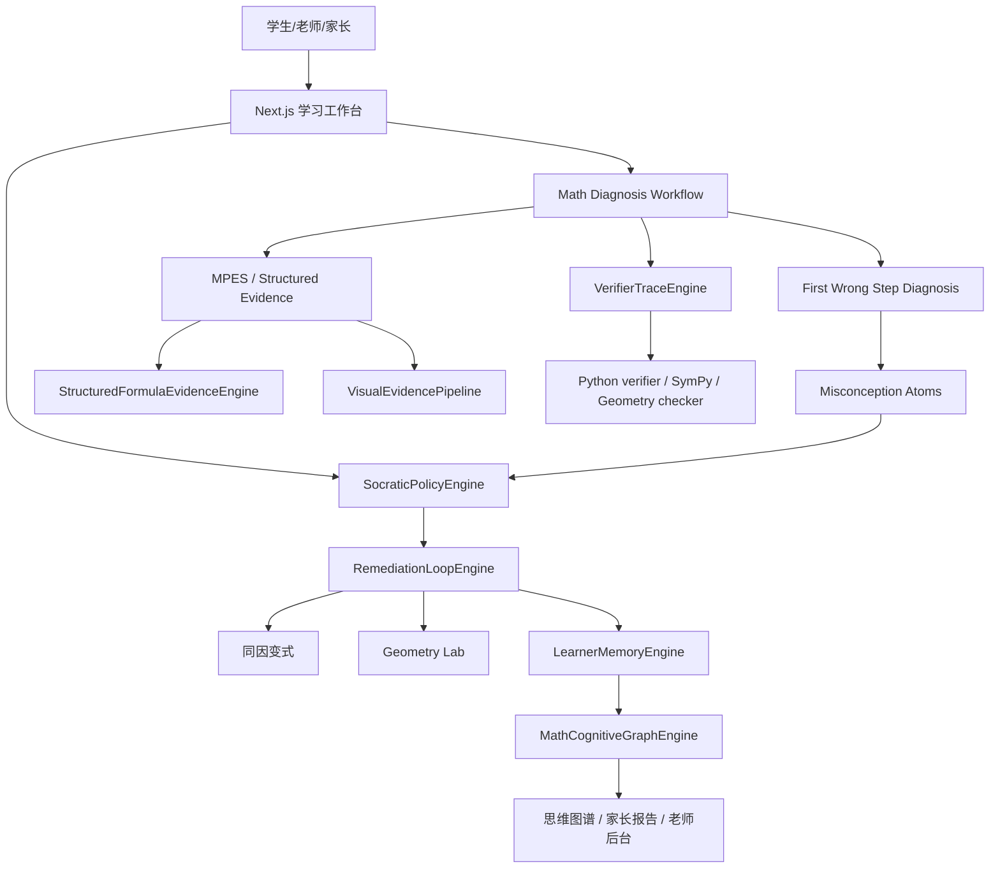

# Agent 与可视化技术架构

## 1. 总体架构

新版系统采用“Learning Agent 工作流层 + 结构化证据层 + 数学验证层 + 学习记忆层 + 可视化训练层”。



一句话分工：

> Math-SEARAG 负责诊断，SocraticPolicyEngine 负责怎么教，LearnerMemoryEngine 负责长期记住学生，VerifierTraceEngine 负责可信，VisualEvidencePipeline 负责不看图瞎讲，MathCognitiveGraphEngine 负责可解释推理，RemediationLoopEngine 负责真正改正。

## 2. 七个核心引擎

| 引擎 | 输入 | 输出 | P0 状态 |
| --- | --- | --- | --- |
| `SocraticPolicyEngine` | problem、studentSteps、diagnosis、memory、evidenceStatus、userIntent | mode、allowedContent、nextPrompts、recommendedAction | 需新增 |
| `LearnerMemoryEngine` | diagnosis、variant result、self repair result | AtomMemory、TopicMemory、StrategyMemory、weeklySummary | 需新增 |
| `VisualEvidencePipeline` | image/OCR/VLM candidates | VisualEvidenceObject、low confidence confirmation | 需新增 |
| `VerifierTraceEngine` | claims、evidenceIds、student steps | VerifierTrace[] | 需新增 |
| `MathCognitiveGraphEngine` | problem graph、reasoning graph、learner graph | MathCognitiveGraph | 已有 thinking graph 雏形，需升级 |
| `StructuredFormulaEvidenceEngine` | LaTeX/OCR/manual formula | FormulaEvidence | 需新增 |
| `RemediationLoopEngine` | diagnosis、policy、memory | variants、transfer records、next plan | 部分已有变式，需闭环 |

## 3. SocraticPolicy 决策模式

```ts
type SocraticPolicyMode =
  | "request_steps"
  | "confirm_evidence"
  | "first_wrong_step"
  | "socratic_hint"
  | "micro_scaffold"
  | "show_correction_card"
  | "generate_variant"
  | "enter_geometry_lab"
  | "human_review";
```

核心规则：

- 没有学生步骤：只请求步骤，不做错因诊断。
- 视觉/公式证据低置信度：先确认 evidence。
- `needHumanReview=true`：显示低置信度诊断，建议老师复核。
- 有 `firstWrongStep`：先追问第一断点，不先给完整答案。
- 错因稳定：给订正卡、同因变式、Geometry Lab 或复习计划。

## 4. VerifierTrace 结构

```ts
type VerifierTrace = {
  id: string;
  claim: string;
  claimType:
    | "derivative"
    | "equivalence"
    | "substitution"
    | "domain"
    | "monotonicity"
    | "endpoint"
    | "classification"
    | "geometry_relation"
    | "proof_step";
  verifier:
    | "typescript_strict_gate"
    | "sympy"
    | "numeric_sampling"
    | "geometry_constraint"
    | "human_review"
    | "lean_optional";
  status: "pass" | "fail" | "warn" | "not_checked";
  evidenceIds: string[];
  inputExpression?: string;
  expectedExpression?: string;
  actualExpression?: string;
  failureReason?: string;
  confidence: number;
};
```

## 5. LearnerMemory 三层结构

```text
AtomMemory：错因原子复发率、迁移率、自我修正率、掌握度。
TopicMemory：题型/知识点掌握状态。
StrategyMemory：学生是否跳过定义域、分类讨论、端点比较、几何约束等策略性检查。
```

学生端显示“本周最该补的 3 个 atom”，家长端显示“为什么不是不会导数，而是跳过定义域和端点检查”，老师端显示“班级错因热力图”。

## 6. VisualEvidence 与 FormulaEvidence

视觉证据原则：

```text
VLM/OCR 可以识别，但不能最终裁判。
视觉信息必须变成 evidence。
低置信度图形关系必须确认。
图上讲解必须绑定 evidence_id。
```

公式证据不能只存 LaTeX，还要存：

- formula tree
- operator tree
- spatial relations
- bbox
- confidence
- low confidence tokens
- user confirmation

## 7. 数据库表方向

```text
diagnosis_jobs
misconception_atoms
atom_memory
topic_memory
strategy_memory
verifier_traces
visual_evidence
formula_evidence
cognitive_graphs
variant_transfer_records
```

## 8. 与现有工程的衔接

- `agent-engineering/frontend/lib/ai/math-diagnosis-workflow.ts`：继续作为诊断工作流入口。
- `agent-engineering/frontend/lib/ai/math-rules-engine.ts`：继续承接 TypeScript strict gate 和错因原子初判。
- `agent-engineering/frontend/lib/geometry/*`：继续承接 GeometrySceneSpec 与 12 关 Geometry Lab。
- `math-own/backend/compute_engine.py`：继续作为 Python verifier/toolbox。
- 新增 `lib/learning-agent/*` 和 `lib/evidence/*`，逐步迁移 SocraticPolicy、LearnerMemory、VerifierTrace、FormulaEvidence、VisualEvidence。
