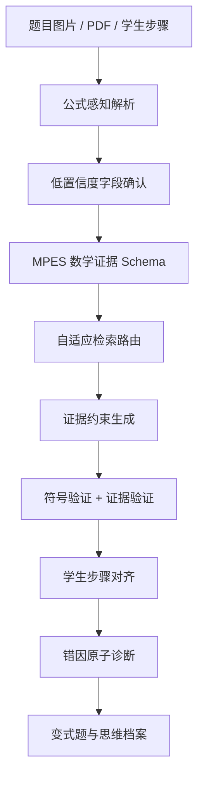

# 论文整理稿：Math-SEARAG 高中数学思维 Agent

整理日期：2026-06-05

## 一、论文最终定位

本项目的论文不建议写成“AI 数学 App 设计说明”，也不建议写成泛泛的“多模态 RAG 幻觉缓解”。更稳妥、更有研究辨识度的定位是：

> 面向高中数学错题诊断/数学试卷问答的公式感知结构化证据增强 RAG，通过 MPES 数学证据 Schema、错因原子图谱和符号验证机制，降低公式幻觉、条件误用和推理跳步，并提升学生错误步骤定位与错因分类的可追溯性。

推荐论文题目：

> 面向高中数学错题诊断的公式感知结构化证据增强 RAG：基于错因原子与符号验证的幻觉缓解方法研究

英文题目：

> Formula-Aware Structured Evidence Enhanced RAG for High-School Mathematics Error Diagnosis with Misconception Atoms and Symbolic Verification

保守投稿题目：

> 面向数学文档问答的公式感知解析与结构化证据增强 RAG 方法研究

## 二、摘要建议稿

高中数学错题诊断不同于普通文本问答。数学题同时包含自然语言、公式结构、变量符号、定义域、参数范围、图形线索和学生多步推理过程。传统 OCR 与通用检索增强生成方法通常将这些信息压缩为普通文本片段，容易造成公式错读、条件遗漏、证据错配和推理跳步。为提升数学问答与错因诊断的可追溯性，本文提出 Math-SEARAG，一种面向高中数学错题诊断的公式感知结构化证据增强 RAG 框架。该框架通过公式感知解析、MPES 数学证据 Schema、自适应检索路由、证据约束生成、符号验证和错因原子诊断，将题目与学生步骤转化为可检索、可验证、可解释的结构化证据链。本文当前版本重点给出方法框架、标注协议、实验设计与原型系统，并规划通过 pilot study 验证其在错误步骤定位、证据 grounding 和幻觉控制方面的潜在价值。正式性能结论需基于真实数据集、强基线、消融实验和统计检验完成。

关键词：高中数学；错因诊断；公式感知 RAG；结构化证据；符号验证；教育 AI

## 三、核心研究问题

| 编号 | 研究问题 |
| --- | --- |
| RQ1 | 公式感知解析与 MPES 结构化证据能否降低数学问答中的公式识别错误、条件遗漏和 unsupported answer？ |
| RQ2 | 不同数学题型是否需要不同检索路径，例如文本检索、公式检索、图形线索检索和关系图检索？ |
| RQ3 | 证据验证与符号验证能否降低结构化 RAG 中的错误传播，并提升答案可信度？ |
| RQ4 | 错因原子图谱能否提升学生错误步骤定位和错因分类的教师一致率？ |
| RQ5 | Human-in-the-loop 低置信度确认能否减少 OCR/公式识别污染对后续推理的影响？ |

## 四、研究假设

| 编号 | 假设 |
| --- | --- |
| H1 | 相比 Direct LLM 与 Naive OCR + Text RAG，Math-SEARAG 能提升答案准确率与证据 grounding。 |
| H2 | 结构化证据对公式密集题、几何图形题和多步推导题的收益高于普通文字题。 |
| H3 | Selective Graph Retrieval 只在关系推理、多跳推理和跨证据组合任务中有明显收益，不应默认用于所有题。 |
| H4 | 符号验证能降低公式幻觉、条件误用和关键推理路径幻觉。 |
| H5 | 错因原子诊断比普通 LLM 讲解更容易与教师评价达成一致。 |

## 五、方法框架

### 5.1 公式感知解析

输入层需要识别：

- 题干文字。
- 公式 LaTeX。
- 上下标、分式、根号、括号范围。
- 定义域、参数范围、边界条件。
- 图形线索，如平行、垂直、角度、交点、函数图像。
- 学生步骤。

低置信度字段必须人工确认。数学题中一个上下标、端点或正负号的错误会污染整个推理链，因此 human-in-the-loop 不是可选增强，而是可靠性门禁。

### 5.2 MPES 数学证据 Schema

MPES 是论文最重要的结构化中间表示。

| 类型 | 含义 | 示例 |
| --- | --- | --- |
| C | 题干条件 | 定义域 x>0 |
| F | 公式 | f'(x)=lnx+1-a |
| G | 图形线索 | AB 垂直 CD |
| S | 学生步骤 | 直接代入求最小值 |
| A | 知识/错因原子 | 端点比较遗漏 |
| V | 验证结果 | 求导通过，条件检查失败 |
| P | 正确路径 | 先定义域，再求导，再分类讨论 |
| E | 错误定位 | S2 为第一处错误 |

### 5.3 自适应检索路由

| 题型 | 推荐路径 | 目的 |
| --- | --- | --- |
| 普通文字题 | Text RAG + 条件匹配 | 避免过度工程化 |
| 公式密集题 | LaTeX / Formula Retrieval | 保留公式结构与符号关系 |
| 几何图形题 | 图形线索 + 关系边检索 | 处理平行、垂直、相似、交点 |
| 多步推导题 | Selective Graph Retrieval | 只在需要多跳关系时触发图检索 |
| 高风险答案 | 生成后验证 + 降置信度输出 | 防止无证据确定性答案 |

### 5.4 符号验证与证据验证

LLM 负责理解、规划与解释；符号系统负责关键计算和条件一致性检查。第一阶段可使用 SymPy 覆盖求导、表达式等价、方程代入和简单数值采样。复杂不等式、几何和高阶证明题可进入人工复核或后续接 Wolfram / Lean。

### 5.5 错因原子诊断

错因原子用于把学生错误从“不会”“粗心”转化为可训练短板：

- 审题漏条件。
- 定义域意识弱。
- 公式记忆错误。
- 代数变形错误。
- 分类讨论缺失。
- 端点比较遗漏。
- 参数分析弱。
- 数形结合弱。
- 几何关系漏读。
- 推理链跳步。

## 六、实验设计

### 6.1 数据集

| 数据集 | 规模 | 用途 |
| --- | --- | --- |
| MVP Set | 5-10 题 | 跑通链路、验证 Schema 与日志 |
| Pilot Set | 50 题 | 修正标注规范、观察趋势、失败分析 |
| Main Test Set | 300-500 题 | 正式论文主结果 |
| External Set | 200-500 题 | 泛化验证 |
| Evidence Corpus | 独立构建 | 教材知识点、定理卡、公式库、标准例题 |

红线：测试题、开发题和 evidence corpus 必须隔离，不能用测试题互相检索。

### 6.2 Baseline

| 方法 | 说明 |
| --- | --- |
| Direct LLM / Closed-book VLM | 不检索，直接回答 |
| OCR + Text RAG | OCR 文本切块检索 |
| OCR + LaTeX RAG | 文本 + 公式联合检索 |
| Structured RAG | 使用 MPES，但不使用路由和验证 |
| Graph / Hybrid RAG | 图检索或混合检索 |
| Full Math-SEARAG | 公式感知解析 + MPES + 路由 + 验证 + 错因诊断 |

消融实验：

- w/o Formula Parsing。
- w/o MPES。
- w/o Adaptive Routing。
- w/o Verification。
- w/o Human Confirmation。
- w/o Misconception Atoms。

### 6.3 评价指标

| 维度 | 指标 |
| --- | --- |
| 解题正确性 | Answer Accuracy、Step Accuracy |
| 公式质量 | Formula Accuracy、Formula Usage Error |
| 证据一致性 | Evidence Faithfulness、Citation Grounding |
| 幻觉控制 | Unsupported Step Rate、Formula Hallucination Rate、Condition Misuse Rate |
| 错因诊断 | Error Localization Accuracy、Misconception Atom Accuracy、Teacher Agreement |
| 检索质量 | Recall@K、MRR、NDCG |
| OCR 质量 | CER、WER、Formula Detect Rate |
| 系统指标 | Latency、Cost、Human Review Rate |

### 6.4 统计检验

- 分类准确率报告 bootstrap 置信区间。
- 成对方法比较使用 McNemar 检验。
- 多方法比较报告均值、方差和置信区间。
- 人工标注一致性报告 Cohen's Kappa。
- 所有失败案例必须保留，不能只展示成功案例。

## 七、相关工作写法

建议相关工作分为六节：

1. RAG 与检索覆盖率。RAG 原始工作可引用 Lewis et al. 的 Retrieval-Augmented Generation for Knowledge-Intensive NLP Tasks。
2. GraphRAG 与领域知识图谱。可参考 Microsoft GraphRAG 项目中“图结构检索增强生成”的思路。
3. 多模态文档理解与结构化 RAG。
4. 数学表达式识别与数学视觉问答。可参考 Pix2Text、MathVista 等方向。
5. 符号验证与数学推理。可参考 SymPy 作为工程验证工具。
6. 教育 AI 与错因诊断。

研究空白建议写法：

> 现有 RAG 与 GraphRAG 工作多面向通用文本、多模态文档或领域知识库，较少针对高中数学题中公式树、条件绑定、图形线索、学生步骤和错因原子的联合结构化表示。现有数学推理系统通常关注答案正确性，而较少关注学生错误发生点与教师可解释错因分类。Math-SEARAG 尝试填补这一空白。

## 八、论文红线

当前文件夹中 `论文max.docx` 含有强结果数字，例如准确率提升、幻觉率降低等。这些数字只能作为“示例 / 预实验模板”，不能作为正式实验结论。

必须避免：

- 把模拟黑盒测试写成真实实验。
- 写“已经证明显著优于”。
- 写“基本满足 Top A 投稿条件”。
- 用测试题互相检索冒充 RAG 证据库。
- 同一模型生成答案又做裁判，且不说明偏差。
- 只展示成功案例，不展示失败案例。

稳健替代表达：

| 高风险表达 | 稳健表达 |
| --- | --- |
| 实验结果证明本方法有效 | Pilot 或示例结果显示该方法具有潜在收益，正式结论需真实实验验证 |
| 提升 24.3% | 若经真实实验复现，可表述为提高 24.3 个百分点 |
| 已满足 Top A 条件 | 当前处于研究方案与原型阶段，仍需真实数据、强基线和统计检验 |
| GraphRAG 显著优于 RAG | GraphRAG 可能在关系推理和多跳场景有效，但不应默认用于所有题型 |

## 九、章节结构

1. 引言：问题背景、数学题特殊性、研究问题、贡献。
2. 相关工作：RAG、GraphRAG、多模态文档、数学 OCR、符号验证、教育 AI。
3. 方法：Math-SEARAG、MPES、路由、验证、错因原子。
4. 实验设计：数据集、标注、baseline、指标、消融、统计检验。
5. 实验结果：只能放真实结果；当前阶段保留表格模板并标注 placeholder。
6. 讨论：题型差异、失败案例、结构化代价、人工确认必要性。
7. 结论：贡献、局限、未来工作。

## 十、已联网核查的参考入口

- [Retrieval-Augmented Generation for Knowledge-Intensive NLP Tasks](https://arxiv.org/abs/2005.11401)
- [Microsoft GraphRAG](https://www.microsoft.com/en-us/research/project/graphrag/)
- [MathVista benchmark](https://arxiv.org/abs/2310.02255)
- [Pix2Text GitHub](https://github.com/breezedeus/Pix2Text)
- [SymPy documentation](https://docs.sympy.org/)
- [Next.js App Router docs](https://nextjs.org/docs/app)
- [Vercel AI SDK docs](https://ai-sdk.dev/docs)
- [Vercel Chat SDK docs](https://chat-sdk.dev)

## 十一、论文下一步

1. 将 `论文max.docx` 中所有强实验结论改为示例或待验证。
2. 固定 MPES v0.1 字段。
3. 固定错因原子 v0.1。
4. 做 5-10 道导数/函数题真实闭环。
5. 建立独立 evidence corpus。
6. 做 50 题 pilot，计算教师一致率和失败案例。
7. 再扩展到 300-500 题正式实验。

